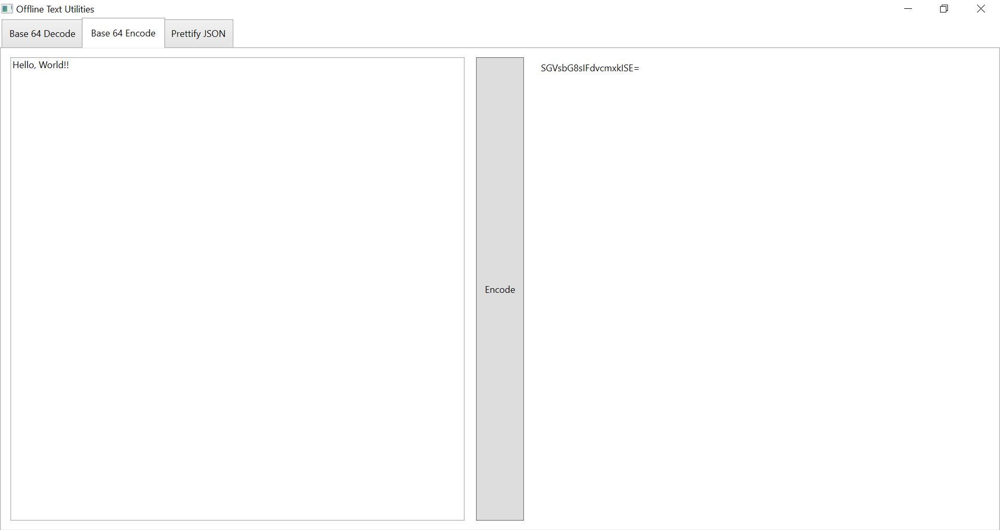
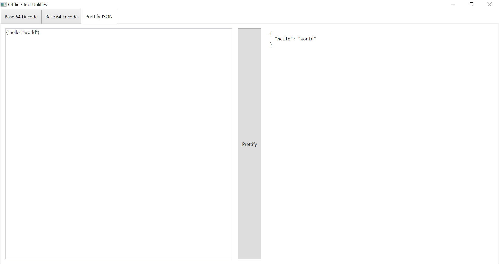

# OfflineTextUtilities
The application runs entirely locally so you can safely enter code snippets into the application.

## Decode Base64

## Encode Base64

## Prettify JSON

## Todo
- Prettify XML
- Allow commerical users to specify Newtonsoft API key (or use open source/free alternative)
- Test scrolling with large inputs