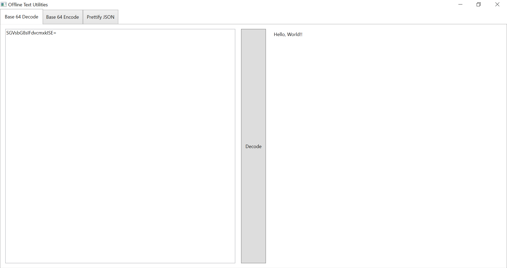

# OfflineTextUtilities

Can be used to:

- Encode Base64
- Decode Base64
- Prettify JSON

The application runs entirely locally so you can safely enter code snippets into the application.

## Screenshots

## Todo
- Prettify XML
- Allow commerical users to specify Newtonsoft API key
